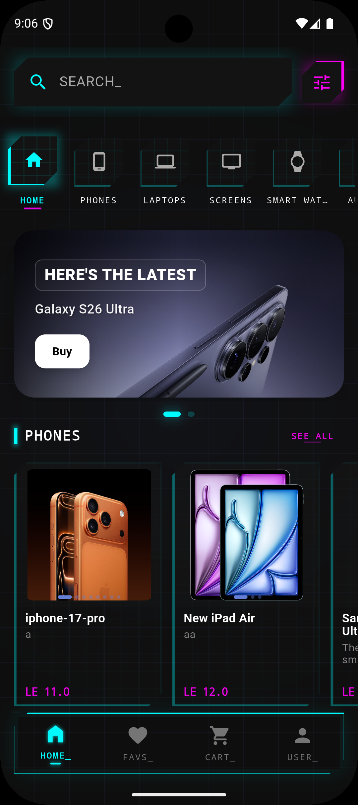

# Electronics Shop

A premium e-commerce mobile application built with Flutter, designed using high-performance components and a technical, data-driven design system. The application connects to a Firebase backend for authentication and database management, with local caching for the shopping cart and user settings.

## Demo




## Architecture

This project is structured according to the principles of Clean Architecture combined with a feature-first approach. By segregating code into distinct layers, the application ensures high scalability, separation of concerns, testability, and decoupling from external framework dependencies.

### Directory Structure

The project code is organized within the `lib` folder as follows:

*   `core/`
    Contains shared services, utilities, themes, global configurations, and constants used across multiple features.
*   `features/`
    Houses distinct business features (e.g., auth, cart, product, profile). Each feature is divided into three layers:
    *   `domain/`: The core business logic layer. It is independent of UI, databases, or third-party libraries. It defines:
        *   Entities: Pure business models.
        *   Repository interfaces: Contracts defining data access methods.
        *   Use cases: Single-responsibility classes implementing specific user flows.
    *   `data/`: The implementation layer for data management. It defines:
        *   Models: Data representations containing JSON serialization and domain mapping logic.
        *   Data sources: Remote (Firestore) and local (Hive) data access points.
        *   Repository implementations: Implementations of the contracts defined in the domain layer.
    *   `presentation/`: The UI layer. It defines:
        *   Controllers: Riverpod Notifiers that manage state and business logic bindings.
        *   Pages/Views: Screens mapped to application routes.
        *   Widgets: Reusable UI components.
*   `routes/`
    Defines the navigation configuration using GoRouter, including route guards, transitions, and auth-state redirection.
*   `l10n/`
    Holds localization configurations for multi-language support (English and Arabic).

---

## Tech Stack & Libraries Used

The application utilizes a robust set of packages to handle state management, local database access, network communication, and system integrations.

### Core Framework & State Management
*   **Flutter & Dart**: Core SDKs for cross-platform rendering.
*   **Flutter Riverpod (`flutter_riverpod`)**: A reactive caching and state-management library that enables compile-safe state isolation and dependency injection.
*   **Riverpod Generator (`riverpod_annotation`, `riverpod_generator`)**: Automated code generator to produce optimized, typed Riverpod providers.

### Navigation & Routing
*   **GoRouter (`go_router`)**: A declarative routing package that provides unified deep-linking, transition animations, and route redirection based on authentication state.

### Storage & Local Caching
*   **Hive & Hive Flutter (`hive`, `hive_flutter`, `hive_generator`)**: A lightweight, lightning-fast key-value database written in pure Dart, used to persist local shopping cart items and user theme preferences.

### Backend & Cloud Services (Firebase)
*   **Firebase Core (`firebase_core`)**: Initializes Firebase connections.
*   **Firebase Auth (`firebase_auth`)**: Handles email/password authentication and federated identity integration.
*   **Google Sign-In (`google_sign_in`)**: Integrates Google authentication provider flows.
*   **Cloud Firestore (`cloud_firestore`)**: A NoSQL document database used for storing order histories, real-time data, and catalog updates.
*   **Firebase Analytics (`firebase_analytics`)**: Tracks user engagement, cart actions, and application performance metrics.

### Networking & Web Utilities
*   **Dio (`dio`)**: A powerful HTTP client for Dart with support for interceptors, global configurations, and request timeouts.
*   **Flutter Dotenv (`flutter_dotenv`)**: Configures application environment variables dynamically using a `.env` file.

### Geolocation & Maps
*   **Google Maps Flutter (`google_maps_flutter`)**: Implements interactive maps for location selection during checkout.
*   **Geolocator (`geolocator`)**: Fetches current user coordinates to pinpoint shipping addresses.
*   **Geocoding (`geocoding`)**: Translates latitude and longitude coordinates into human-readable physical addresses.

### UI/UX Assets & Viewers
*   **Cached Network Image (`cached_network_image`, `flutter_cache_manager`)**: Efficiently downloads, saves, and displays network-hosted product images.
*   **Flutter Svg (`flutter_svg`)**: Renders high-quality vector icons and HUD components.
*   **Easy Image Viewer (`easy_image_viewer`)**: Provides zoomable, full-screen galleries for product images.
*   **Internet Connection Checker Plus (`internet_connection_checker_plus`)**: Detects network connectivity states in real time to display a fallback banner when offline.
*   **Fuzzy (`fuzzy`)**: A client-side fuzzy search package for flexible, typo-tolerant text filtering of product catalogs.

---

## Getting Started

### Prerequisites
*   Flutter SDK (v3.11.4 or higher recommended)
*   Cocoapods (for iOS deployments)
*   Android SDK / Xcode for target devices

### Installation

1.  Clone the repository and navigate to the project directory:
    ```bash
    git clone https://github.com/abod8639/electronics_shop.git
    cd electronics_shop
    ```

2.  Install dependencies:
    ```bash
    flutter pub get
    ```

3.  Configure environment variables by setting up your `.env` file in the root directory.

4.  Run the code generation tool to build model serializers, Hive adapters, and Riverpod providers:
    ```bash
    flutter pub run build_runner build --delete-conflicting-outputs
    ```

5.  Launch the application:
    ```bash
    flutter run
    ```
